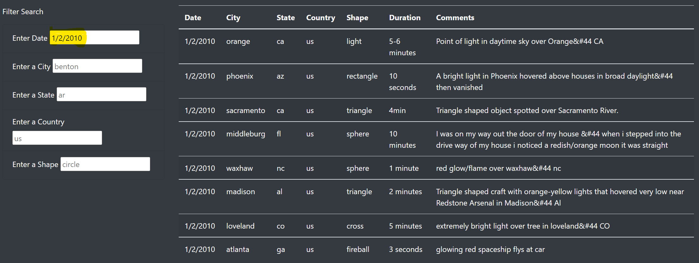
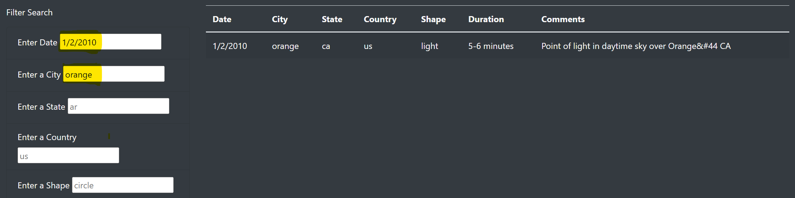
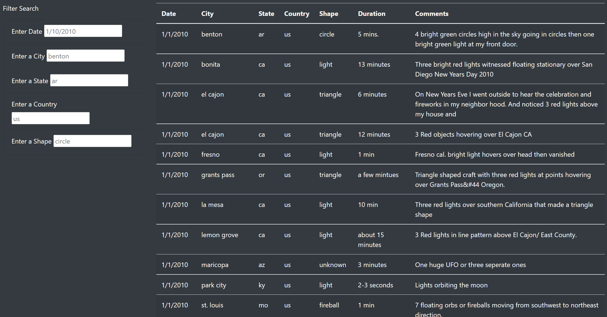

# UFOs

## Purpose
Creating a webpage using HTML while utilizing javascript to run filter functions.

## Results
All data is displayed after loading the website from: data.js (sorted right)
Filter table of data desired can be found in "Filter Search" (sorted left).
Data filtered by:date, city, state, country, shape. 

Enter the filter you would like to apply, and click enter to filter the table.

Multiple filters can be applied at once.

To revert table back --> click "UFO Sightings" in the top left corner to reset.

## Summary
This makes filtering for specific data easy but dfor someone that wnts a bigger picture of the data they will have to spend more time fltering for that data. A simplified list of the filters could be amde for the top 10 most searched filters, this could simplify the site for the majority that would visit it or to remove all filters with a "clear" button.
